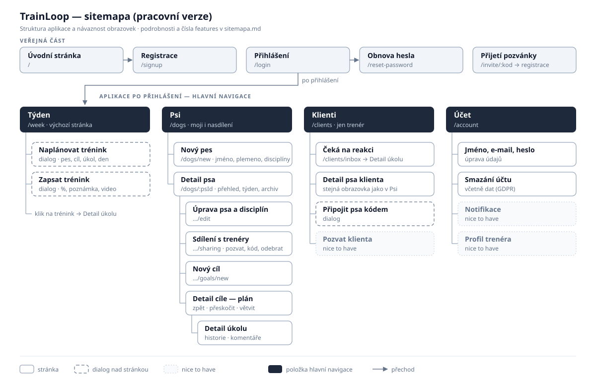

# TrainLoop — Sitemapa (pracovní verze)

**Stav:** první verze z briefu, upraveného plánu a Lean Canvasu, na hackathon 9. 10. 2026.
**Navazuje na:** [feature-breakdown.md](feature-breakdown.md), čísla `F-xx` odkazují na řádky breakdownu.

**Hlavní předpoklad:** existuje jeden typ účtu a role (psovod / trenér) se řídí vztahem ke konkrétnímu psovi (F-03). Sekce **Klienti** se zobrazí, jakmile uživateli někdo nasdílí psa. Pokud PO rozhodne, že trenér je zvláštní typ účtu, rozdělí se navigace na dvě varianty (viz konec dokumentu).

---

## Diagram

Vlevo nahoře je veřejná část, pod ní hlavní navigace po přihlášení. Odsazení znamená „vede z“, legenda je pod diagramem. Detail úkolu je jedna obrazovka, na kterou se dá dostat z Týdne, z Detailu cíle i ze seznamu Čeká na reakci.

---

## Hierarchie obrazovek

### Veřejná část

| Obrazovka | Návrh URL | Obsah | Features | Priorita |
| --- | --- | --- | --- | --- |
| Úvodní stránka | `/` | Co TrainLoop je, pro psovody i trenéry, odkaz na přihlášení a registraci | — | MVP |
| Přihlášení | `/login` | E-mail, heslo, odkaz na obnovu hesla | F-01 | MVP |
| Registrace | `/signup` | Jméno, e-mail, heslo, souhlas se zpracováním údajů | F-01, F-63 | MVP |
| Obnova hesla | `/reset-password` | Žádost o e-mail, pak nastavení nového hesla | F-02 | MVP |
| Přijetí pozvánky | `/invite/:kod` | Kdo zve a ke kterému psovi, tlačítko Přijmout. Nepřihlášeného pošle na registraci nebo přihlášení a pak zpět | F-09 | MVP |

### Aplikace po přihlášení

**Týden** · `/week` · výchozí stránka po přihlášení · MVP
- Kalendář po dnech (Po–Ne) a v každém dni naplánované tréninky ze všech psů a disciplín, barevně podle disciplíny (F-27)
- Přepínání týdnů ← → (F-30), filtr psa a disciplíny (F-31, Nice)
- Přesun tréninku mezi dny (F-29)
- Dialog **Naplánovat trénink**: vyberu psa, cíl a aktivní úkol a k němu den (F-28)
- Dialog **Zapsat trénink** přímo z položky: %, poznámka, odkaz na video (F-35, F-36)
- Klik na položku → Detail úkolu
- *Nice:* upozornění na disciplínu bez tréninku (F-33), nesplněné z minulého týdne (F-32), návrh rozvrhu (F-34)

**Psi** · `/dogs` · MVP
- Seznam mých psů a psů, které mi někdo nasdílel (s označením role)
- **Nový pes** · `/dogs/new`: jméno, plemeno, disciplíny (F-05, F-07)
- **Detail psa** · `/dogs/:psId`
  - Přehled: aktivní cíle seskupené podle disciplín, u každého aktuální krok (F-24)
  - Týden psa: stejný kalendář jako *Týden*, jen pro tohoto psa (F-46, hlavně pro trenéra)
  - Archiv: dokončené a opuštěné cíle (F-23)
  - Trenéři: kdo má přístup (F-12)
- **Úprava psa a disciplín** · `/dogs/:psId/edit` (F-08)
- **Sdílení s trenéry** · `/dogs/:psId/sharing`: pozvat e-mailem, vygenerovat kód, odebrat přístup (F-09, F-10, F-13; F-14 Nice)
- **Nový cíl** · `/dogs/:psId/goals/new`: disciplína, název, popis, první úkoly (F-15, F-16)
- **Detail cíle (plán)** · `/dogs/:psId/goals/:cilId`
  - Cesta úkolů se stavy a vyznačeným aktuálním krokem (F-16, F-17)
  - Akce nad cestou: vrátit o krok, přeskočit, vložit mezikrok, rozvětvit (F-18–F-21)
  - Dokončit nebo archivovat cíl (F-23)
  - *Nice:* historie změn (F-25), zkopírovat cíl k jinému psovi (F-26), graf úspěšnosti (F-39)
- **Detail úkolu** · `/dogs/:psId/goals/:cilId/tasks/:ukolId`
  - Instrukce a stav úkolu
  - Historie tréninků: datum, %, poznámka, video (F-37, F-38; náhled videa F-40 Nice)
  - Vlákno komentářů psovod ↔ trenér (F-42)
  - Tlačítko Zapsat trénink, Naplánovat

**Klienti** · `/clients` · zobrazí se jen trenérovi · MVP
- Seznam psů klientů s psovodem a poslední aktivitou (F-44)
- **Čeká na reakci** · `/clients/inbox`: nové záznamy tréninků bez reakce trenéra, klik vede na Detail úkolu (F-45)
- Dialog **Připojit psa kódem** (F-10)
- *Nice:* pozvat klienta, ať mu psa nasdílí (F-11)
- *Nice:* soukromé poznámky ke klientovi (F-47)

**Účet** · `/account` · MVP
- Jméno a e-mail, změna hesla (F-01)
- Smazání účtu včetně dat (F-63)
- *Nice:* představení trenéra (F-04), nastavení notifikací (F-48–F-51)

---

## Systémové obrazovky a stavy

| Situace | Kde | Co uživatel uvidí |
| --- | --- | --- |
| Nový uživatel bez psa | Týden, Psi | Prázdný stav s výzvou „Založte prvního psa“ (psovod) nebo „Připojte psa kódem“ (trenér) |
| Pes bez cílů | Detail psa | Výzva k založení prvního cíle |
| Týden bez tréninků | Týden | Prázdný stav a odkaz na naplánování |
| Trenér bez klientů | Klienti | Návod, jak psa připojit (kód / pozvánka) |
| Nic nečeká na reakci | Čeká na reakci | „Vše máte zodpovězené“ |
| Neplatná nebo vypršelá pozvánka | Přijetí pozvánky | Vysvětlení a co dělat dál |
| Přístup k psovi byl odebrán | Detail psa | „K tomuto psovi už nemáte přístup“ místo obsahu |
| Neexistující stránka | jakákoli | 404 |
| Chyba serveru / bez připojení | jakákoli | Chybová obrazovka s možností zkusit znovu |
| Potvrzení nevratných akcí | Sdílení, cíl, záznam, účet | Dialog „Opravdu odebrat / smazat?“ |

---

## Hlavní cesty uživatele (pro ověření flow)

1. **Psovod začíná:** Registrace → Nový pes (+ disciplíny) → Nový cíl s úkoly → Týden → Naplánovat trénink.
2. **Po tréninku venku na mobilu:** Týden → položka dne → Zapsat trénink (%, poznámka, video) → hotovo.
3. **Psu nejde:** Detail úkolu (vidí historii s nízkým %) → Detail cíle → Vrátit o krok / Vložit mezikrok → Týden → přeplánovat.
4. **Propojení s trenérem:** Detail psa → Sdílení → pozvat e-mailem → trenér: e-mail → Přijetí pozvánky → Registrace → Klienti.
5. **Trenér reaguje:** Klienti → Čeká na reakci → Detail úkolu (video, %) → komentář → Detail cíle → upraví další krok.
6. **Psovod si přečte reakci:** Týden nebo Detail úkolu → vlákno komentářů → vidí upravený plán.

---

## Otevřené otázky ke struktuře

- **Zvláštní trenérský účet?** Pokud ano, trenér má jako výchozí stránku *Klienti* místo *Týden* a registrace se rozdělí na „jsem psovod / jsem trenér“.
- **Větvení cíle:** podoba obrazovky *Detail cíle* (seznam vs. strom/graf) závisí na tom, jak větvení vypadá v praxi. Je to první kandidát na wireframe.
- **Je nutná samostatná obrazovka Historie** napříč psem/disciplínou, nebo stačí historie u úkolu a archiv cílů?
