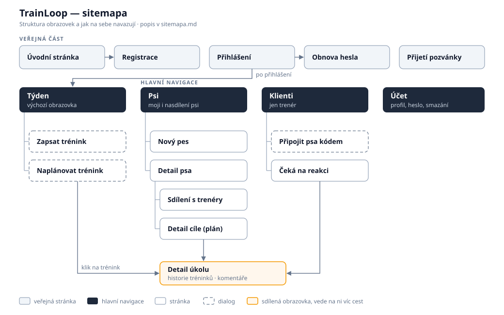

# TrainLoop — Sitemapa

**Stav:** podklad na hackathon 9. 10. 2026, sladěný s [wireframem ve Figmě](https://www.figma.com/design/IjEnmXXeJB8YBOWPjWiFu3/Trainloop-wireframe?node-id=0-1). Čísla `F-xx` odkazují na [feature-breakdown.xlsx](feature-breakdown.xlsx).

## Pojmy

| Pojem | Význam | Příklad |
| --- | --- | --- |
| **Disciplína** | Oblast, ve které pes trénuje | canicross, nosework, poslušnost |
| **Cvik** | Jeden konkrétní krok | „Běh v plném tahu 400 m“, „oční kontakt“ |
| **Sekvence cviků** | Několik cviků, které jdou vždy po sobě jako jeden blok | rozběh → 3× 400 m → vyklusání |
| **Plán** | Cviky a sekvence seřazené za sebou, případně rozvětvené. Trenér ho skládá pro psa v disciplíně na obrazovce *Tvorba tréninku* | „Trénink pro Rexe“ ve wireframu |
| **Trénink** | Jedno cvičení v konkrétní den v kalendáři. Psovod ho prochází cvik po cviku | „Alík Canicross Trénink“ v pátek |
| **Záznam** | Co psovod po tréninku odešle: video a komentář | |

## Jak vzniká a probíhá trénink

1. **Trenér pozve klienta** (Klienti → Pozvat klienta). Klient na úvodní obrazovce zvolí *Mám pozvánku*, zaregistruje se a založí psa. Pes se trenérovi objeví v *Klientech*.
2. **Trenér otevře psa klienta:** *Klienti* → klient → *Detail klienta* → jeho pes → *Pes*. Je to stejná obrazovka, jakou vidí psovod u svého psa.
3. **Trenér složí trénink:** na obrazovce *Pes* tlačítkem + otevře *Tvorbu tréninku*. Přidává bloky dvou typů, *Jednotlivý cvik* a *Sekvenci cviků*, a spojuje je šipkami. Cesta se může rozdělit na dvě větve a ty se pak znovu spojí. Tlačítko + přidá blok, přetažením do koše se blok smaže.
4. **Trenér trénink naplánuje:** po uložení vybere, ve které dny se má cvičit (např. každé pondělí a čtvrtek, od–do). Trénink se tím objeví klientovi v *Týdnu* a v *Aktivitách* psa. Den má v kalendáři barevný proužek podle psa, po kliknutí na den se zobrazí karta tréninku se seznamem cviků.
5. **Psovod trénuje.** Otevře trénink a prochází cviky jeden po druhém („Aktuální cvik 3/20“, šipky vlevo a vpravo).
6. **Psovod odešle záznam.** Na obrazovce *Konec* nahraje video, napíše komentář a odešle.
7. **Trenér reaguje.** U klienta v *Klientech* svítí štítek „čeká na reakci“. Trenér si záznam prohlédne, odpoví a podle výsledku upraví plán v *Tvorbě tréninku*. Obrazovka pro odpověď ve wireframu zatím chybí.

## Obrazovky

Sloupec *Wireframe* uvádí název rámce ve Figmě, nebo „chybí“, pokud obrazovku je ještě potřeba nakreslit.

| Obrazovka | Wireframe | Co na ní je | Features |
| --- | --- | --- | --- |
| **Úvodní stránka** | Uvodní stránka | Co je TrainLoop, tlačítka *Mám pozvánku*, *Přihlásit se*, *Registrace* | — |
| ↳ Mám pozvánku | chybí | Zadání kódu od trenéra (nebo otevření odkazu z e-mailu), pak registrace a propojení s trenérem | F-08, F-09 |
| ↳ Registrace, Přihlášení, Obnova hesla | chybí | Standardní formuláře | F-01, F-02 |
| **Psi** | Psi | Seznam psů s fotkou, jménem a plemenem. Barevný proužek = barva psa v kalendáři. Tlačítko + přidá psa | F-04, F-06 |
| ↳ Nový pes | chybí | Jméno, plemeno, fotka, disciplíny | F-04, F-05 |
| ↳ **Pes** (detail) | Pes | Fotka, jméno, plemeno a *Aktivity*, tedy tréninky psa po dnech. Tlačítko + vede na *Tvorbu tréninku* | F-07, F-26 |
| ↳ ↳ **Tvorba tréninku** | Tvorba tréninku | Plán z bloků *Jednotlivý cvik* a *Sekvence cviků*, větvení a spojení, + přidat blok, koš smazat | F-12 – F-16 |
| ↳ ↳ ↳ Naplánovat trénink | chybí | Po uložení tréninku: dny v týdnu a období (od–do). Trénink se pak objeví v Týdnu klienta | F-20 |
| **Týden** | Týden | Výběr týdne, dny Po–Ne s barevnými proužky podle psů. Po kliknutí na den karta tréninku („Alík Canicross Trénink“ a seznam cviků) | F-19 – F-22 |
| ↳ Trénink (průchod) | Trénink | „Aktuální cvik 3/20“, název cviku, šipkami na předchozí a další cvik | F-43 |
| ↳ Trénink (konec) | Trénink | *Nahrát video*, *Komentář*, *Odeslat* | F-24, F-25, F-30 |
| **Klienti** (jen trenér) | Klienti | Karty klientů (jméno, e-mail), štítek „čeká na reakci“ | F-31, F-32 |
| ↳ Pozvat klienta | chybí | E-mail klienta nebo kód / odkaz k předání na lekci | F-08, F-09 |
| ↳ Detail klienta | chybí | Psi klienta (klik vede na *Pes*, odkud trenér zadává tréninky) a záznamy čekající na reakci | F-31, F-32 |
| ↳ Reakce trenéra | chybí | Odeslaný záznam (video, komentář) a odpověď trenéra | F-30 |
| **Profil** | Účet | Jméno, e-mail, změna hesla, odhlásit se, smazat účet | F-01, F-39 |

**Navigace** (spodní lišta ve wireframu): Psi · Týden · Klienti · Profil.

## Hlavní cesty

1. **Trenér začíná:** Registrace → Klienti → Pozvat klienta.
2. **Klient se připojí:** Úvodní stránka → Mám pozvánku → Registrace → Nový pes → pes se trenérovi objeví v Klientech.
3. **Trenér zadá trénink:** Klienti → Detail klienta → Pes → + → Tvorba tréninku → Naplánovat trénink → trénink je v Týdnu klienta.
4. **Psovod trénuje:** Týden → den → Trénink (cvik po cviku) → Konec → video, komentář → Odeslat.
5. **Trenér reaguje:** Klienti („čeká na reakci“) → Detail klienta → Reakce trenéra → případně úprava v Tvorbě tréninku.

## Systémové obrazovky a stavy

| Situace | Co uživatel uvidí |
| --- | --- |
| Prázdné stavy (bez psa, prázdný týden, trenér bez klientů) | Výzva k dalšímu kroku: přidat psa, počkat na trénink od trenéra, pozvat klienta |
| Neplatná nebo vypršelá pozvánka / kód | Vysvětlení a co dělat dál |
| Trenér ukončil spolupráci | „K tomuto psovi už nemáte přístup“ |
| Nevratná akce (smazání bloku, psa, účtu) | Potvrzovací dialog |
| Neexistující stránka, chyba serveru | 404 / chybová obrazovka s možností zkusit znovu |

Otázky pro PO jsou v [otazky-na-klienta.md](otazky-na-klienta.md).
